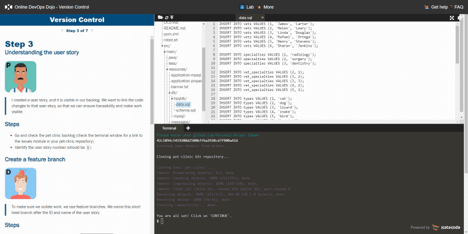
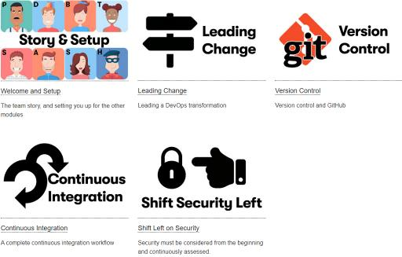

## DevOps Dojos

DevOps Dojos became popular since Target, an important U.S.-based retail company, started to introduce such a practice back in 2014 in support of its DevOps transformation.
Since then, multiple conference talks, white papers and — more recently — books have been published about DevOps Dojos.

Back in 2015, we created our own DevOps Dojos, which we have described in multiple talks - [1](https://www.youtube.com/watch?v=nhokY2UpBqI){:target="_blank" rel="noopener"}, [2](https://www.youtube.com/watch?v=75aZRf0_wSo){:target="_blank" rel="noopener"}, [3](https://www.youtube.com/watch?v=5ejcK1sTv6k){:target="_blank" rel="noopener"} - in conferences and meetups, sharing our own experience.

Since then, our own employees and customers alike have been taking advantage of the DevOps Dojo.

Yet, we quickly came to a point where our physical DevOps Dojos were not enough to cover all the needs. Everyone was loving the
experience, and to this day the on-site experience still leads to great results. But we had a scale issue: we just could not accommodate everyone we needed to address.

Let us introduce "**Online DevOps Dojos**".

## Extending with Online DevOps Dojo

While continuing physical and face-to-face DevOps Dojos, we needed to complete the picture with an online add-on. We wanted an add-on, not a replacement, that we could use to:

* Prepare for a face-to-face or virtual DevOps Dojo by learning techniques in advance
* Create a complete curriculum with hands-on labs
* Provide a way to get knowledge when you most need it, all within your browser
* Share what "good looks like" when answering a question around any DevOps pattern
* Leverage [the story](#a-story) and the characters, and even extend the story to create more learning experiences — not necessarily DevOps-related

We could easily have written slides or recorded videos from our DevOps coaches. But we thought it would have been a sub-par learning experience.

And so we started creating an immersive online learning experience: the "Online DevOps Dojo."

What we recently found in light of unprecedented events — such as a global pandemic — is that online learning experiences are now an essential part of a "new normal." They are a new way of acquiring knowledge and sharing it with others. Social distancing has accelerated that movement.

## A Story

Our challenge was to make the experience immersive. And to immerse yourself in something, there is nothing better than a good story. So, we created one to support the training.

The modules tell the story of a fictitious company, "Pet Clinic," and its employees as they go through their DevOps journey.

Let us introduce you to some of the team members:

|  |  |
| - | - |
|  | **B**renda from the **B**usiness, who is keen to take the Pet Clinic into new growth areas, sees DevOps being key to that. She is extremely proud of her two golden retrievers Bonnie and Clyde. |
|  | **C**hun is a **c**oach, change facilitator and technologist. Chun is an avid outdoors person and adrenaline junky, lover of fun, hater of being on-call. She encourages teams to automate the build, test, package and deploy process as much as possible of to ensure that the systems are created with a LessOps model in mind. |
|  | **D**an has worked as a senior developer for a number of years, most recently for First Order Incorporated, a role he left due to the excessive travel requirements. Dan's workmates still fondly recall the fun and games that ensued when Shelob, his pet tarantula, got loose on *"Bring Your Pets to Work"* day. |
|  | **A**dam is a System **A**dministrator transitioning to the role of Site Reliability Engineer (SRE). Adam is working closely with the Security Officer to ensure the security of the company's software and applications. Adam has a particular set of skills so he is working on a plan to look for the hacker, to find the hacker, to ... the hacker. |

Throughout the modules, you get to learn about everyone (including more characters), interact with them, and understand how each one plays a role in the DevOps transformation of the Pet Clinic company.

## Learning modules

The Online DevOps Dojo learning modules illustrate important DevOps patterns as described in various blog posts, white papers and great books such as "[Accelerate](https://itrevolution.com/book/accelerate/)" by Nicole Forsgren, Jez Humble and Gene Kim.

At launch, we released 5 modules:

* Welcome and Setup
* Leading Change
* Version Control
* Continuous Integration
* Shift Security Left

Those modules are a mix of both cultural and technical topics.

The modules provide a very interactive experience in which you can follow the step-by-step instructions as well as go off script to explore and learn more, without fear of breaking anything.

## Open Source

The Online DevOps Dojo learning modules are released under the [Mozilla Public License 2.0](https://github.com/dxc-technology/online-devops-dojo/blob/master/LICENSE).

We are making the Online DevOps Dojo available to benefit the entire development community. We hope the modules will be useful. Our primary goal is to contribute a set of DevOps learning experiences so the community can assemble and create more content in support of DevOps adoption. (It is not about offering training as a service.)

## What's next?

First, we would like to welcome everyone trying out the learning modules. We sincerely hope they will help in supporting your DevOps adoption.

Second, we plan to release new modules, depending on the reception of the initial launch.

Beyond the initial launch, we are eager to build a community around the Online DevOps Dojo — a community of module maintainers, translators, story tellers and even creators of new learning modules.

Let’s support DevOps adoption!
