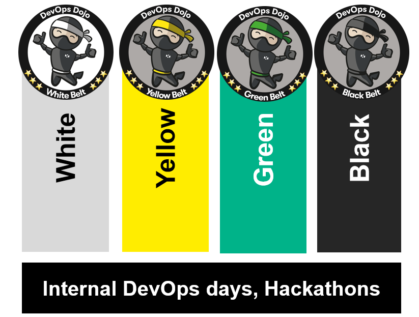

[DXC Technology](https://www.dxc.technology/) has embraced the need for DevOps' transformation both internally and for our customers. DXC have created and used multiple homegrown Katacoda scenarii to transform our workforce at scale. We now want through the **Online DevOps Dojo** want to give something back and thus contribute to the community from whom we have learnt so much.

## Background

DXC Technology had a need, a need for speed!

When DXC Technology launched in April 2017, the new company faced an immediate challenge: how to provide meaningful and engaging training for more than 100,000 delivery employees who needed to use DevOps to digitally transform DXC and our clients.

To that end DXC developed the DevOps Dojo program, an immersive approach designed to quickly train teams in DevOps principles and practices promoting continuous improvement, increased velocity through automation, frequent cycle changes, and cross-functional cooperation and feedback. Traditional dojos involve face-to-face training, but for the sake of scale and flexibility, DXC developed a set of immersive, web-based interactive training modules.

Our approach and curriculum was inspired by the topics covered by the book [Accelerate: The Science of Lean Software and DevOps: Building and Scaling High Performing Technology Organizations](https://itrevolution.com/book/accelerate/) from Nicole Forsgren, Jez Humble and Gene Kim.

The modules in **Online DevOps Dojo** are a subset of the modules from our market leading DevOps Dojo Curriculum.

The full Curriculum consists of four belts:

- White: Basic, self-paced interactive training in key DevOps practices (the “what”).

- Green: Executive-level view of the principles, purpose and importance of DevOps (the “why”).

- Yellow: Hands-on interactive modules hosted in Katacoda covering cultural and technical aspects of DevOps* (the “how”).

- Black: Hands-on workshop in which cross-functional teams work with the help of dedicated DevOps coaches, to implement DevOps capabilities and practices in their applications.

## Yellow Belt Syllabus

The **Online DevOps Dojo** is comprised of a selection of key modules from our **Yellow Belt DevOps Dojo**.

The current list of modules in the **Yellow Belt DevOps Dojo** is

- [Welcome](https://dxc-technology.github.io/about-devops-dojo/katacoda/os1-welcome/)

- Binary Management

- ChatOps

- Continuous Testing

- [Continuous Integration](https://dxc-technology.github.io/about-devops-dojo/katacoda/os4-continuous-integration/)

- DevOps Kaizen

- Infrastructure as Code

- [Leading Change](https://dxc-technology.github.io/about-devops-dojo/katacoda/os2-leading-change/)

- Monitoring

- Post Incident Practices

- [Version Control](https://dxc-technology.github.io/about-devops-dojo/katacoda/os3-version-control/)

- Running a Value Stream Mapping Workshop

- [Shift Security-Left](https://dxc-technology.github.io/about-devops-dojo/katacoda/os5-shift-left-security/)

- Test Automation Strategies

- Test Automation Strategy Implementation

- Test Driven Development

- Value Stream Mapping

More modules are planned both for the **Online DevOps Dojo** and the **Yellow Belt DevOps Dojo**.

Links are provided above to the modules currently available in the **Online DevOps Dojo**.

## Contact DXC Technology for more information on our DevOps Dojos?

If you are interested to learn more about DXC Technology's DevOps Dojo belts and stripes, please [contact us](mailto:%22Online%20DevOps%20Dojo%22%3c9517cf01.CSCPortal.onmicrosoft.com@amer.teams.ms%3e).